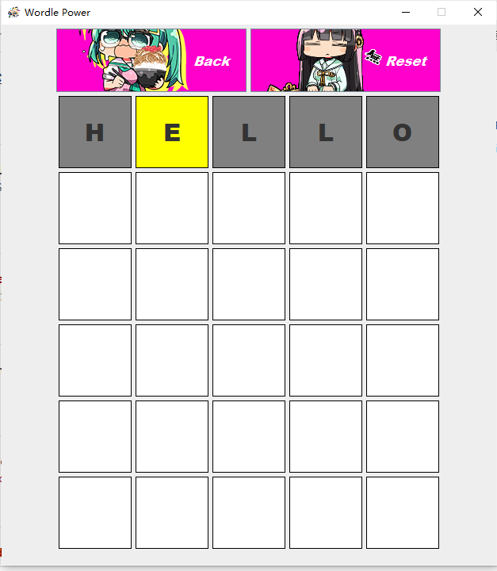
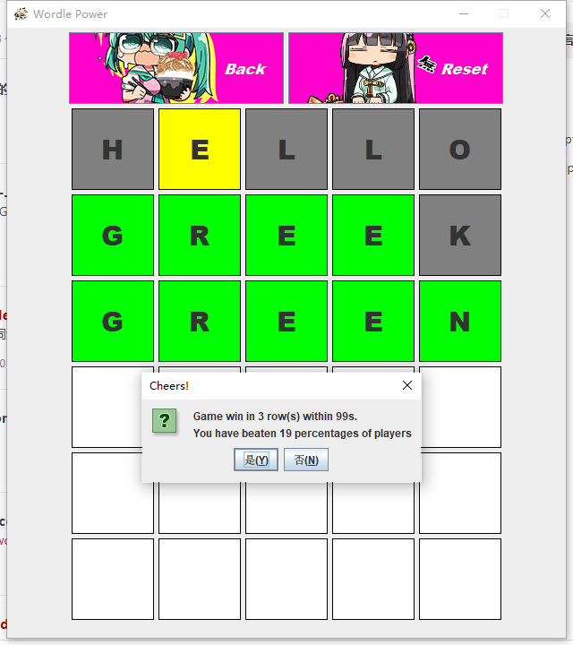
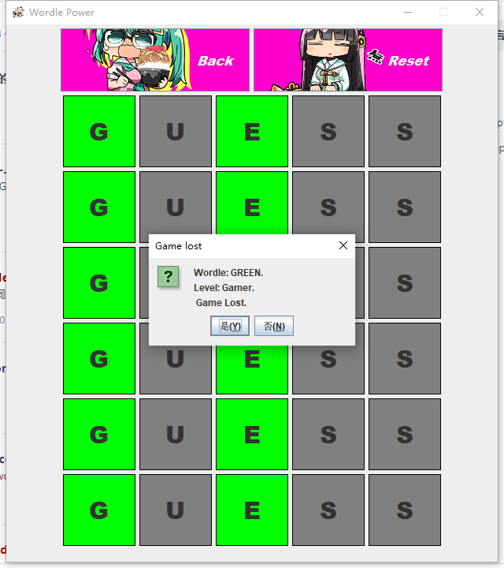
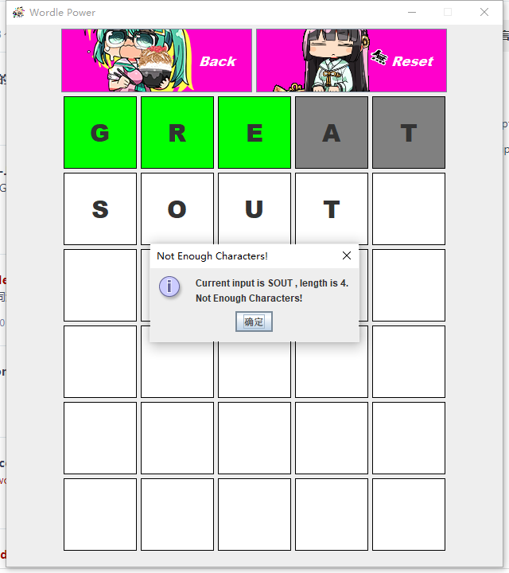
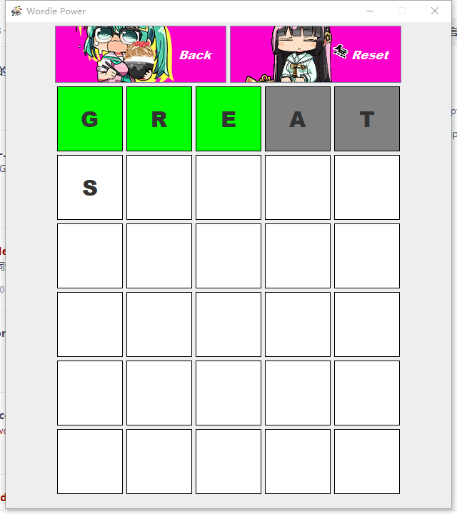
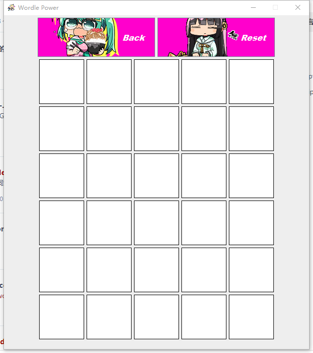
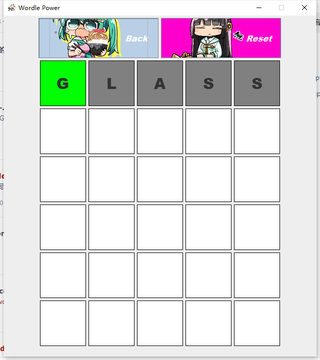
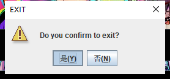

# Wordle

#### Description

A wordle game finished by using Java and Java GUI.

#### Software Architecture

Software architecture description

#### Installation

1. Open IDEA (community).
2. Open ProjectPath, Trust it.
3. Double clicked ./src/Wordle, press Ctrl + Shift + F10.
4. Program runs.

#### Instructions

1. Click start button to start game.
2. Press any characters on your keyboard to input.
3. Press ‘Enter’ or ‘Space’ to submit; Press ‘Backspace’ to withdraw one current input.
4. If no input at current line but is submit, you will get a warning, so does not enough chars at current line.
5. If an input is submitted and is regarded as a word by the program, the program will display colors of every character.
6. If you got an all Green feedback within 6 (include) tries, you won; Otherwise you lose.
7. Then you will return to the start panel.
8. Or you can click reset button to restart a game.
9. Or you can click back button to focus to quit this game and return to the start panel.

#### Display

Start Panel

Fisrt game（Lock Wordle 'GREEN'）

Empty Input

Submit without finishing

Input false word

Right Input

Another game（Lock）

Fail 6 times(Lost)

Another game（Lock）

Arbitrarily input

Backspace

Reset
(Update wordle word with unlock model, 
but I force it to “GREEN” 
by adding a statement at the end of the method)

Another finishing.(20s better than 42% of my game?)

Another game（Lock）

Arbitrarily input

Force to back

Open again

Exit

Cancel

Ok

Game ends.

Settings and Ranks are not yet finished.

#### Gitee Feature

1. You can use Readme\_XXX.md to support different languages, such as Readme\_en.md, Readme\_zh.md
2. Gitee blog [blog.gitee.com](https://blog.gitee.com)
3. Explore open source project [https://gitee.com/explore](https://gitee.com/explore)
4. The most valuable open source project [GVP](https://gitee.com/gvp)
5. The manual of Gitee [https://gitee.com/help](https://gitee.com/help)
6. The most popular members  [https://gitee.com/gitee-stars/](https://gitee.com/gitee-stars/)
