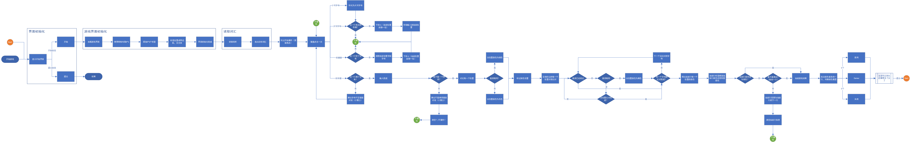

# Wordle-java

#### 介绍

一个利用java实现的具有可视化界面的单机Wordle小游戏，希望你能喜欢，也欢迎参考借鉴！
（其实就是一个小作业）

#### 软件架构

软件架构说明

#### 设计流程图

#### 安装教程

1. git clone 本仓库
2. 用Wordle.java运行

#### 使用说明

1. 如你所见，还很粗糙

#### 参与贡献

1. Fork 本仓库
2. 新建 Feat_xxx 分支
3. 提交代码
4. 新建 Pull Request

