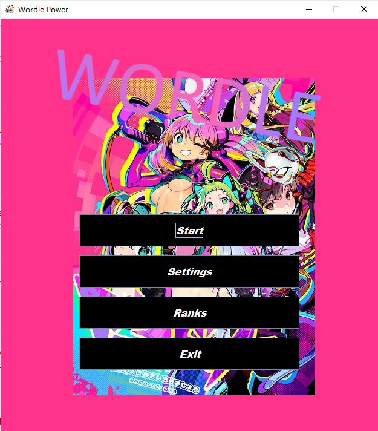
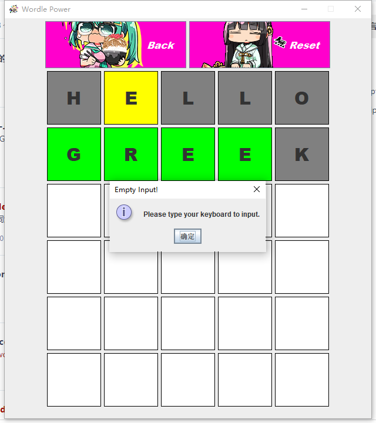
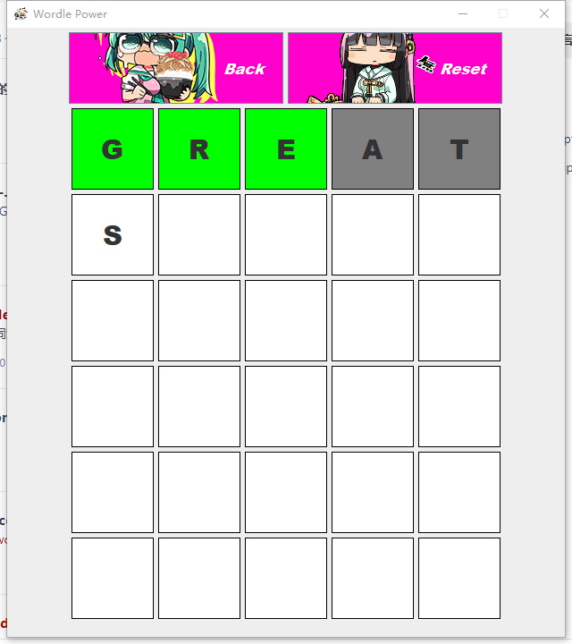
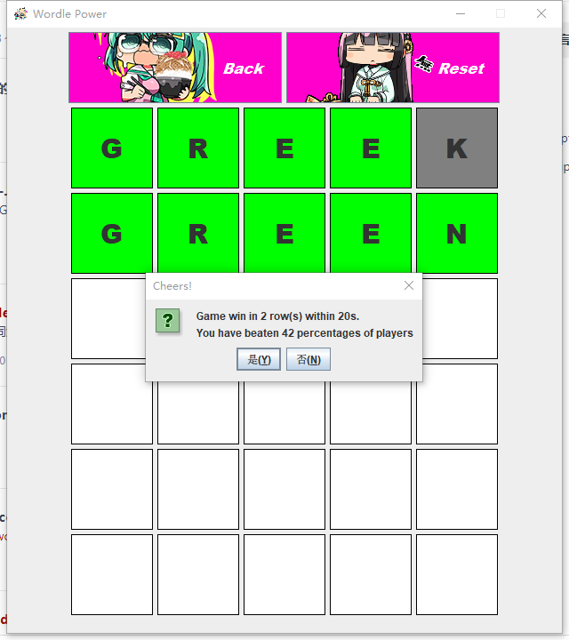
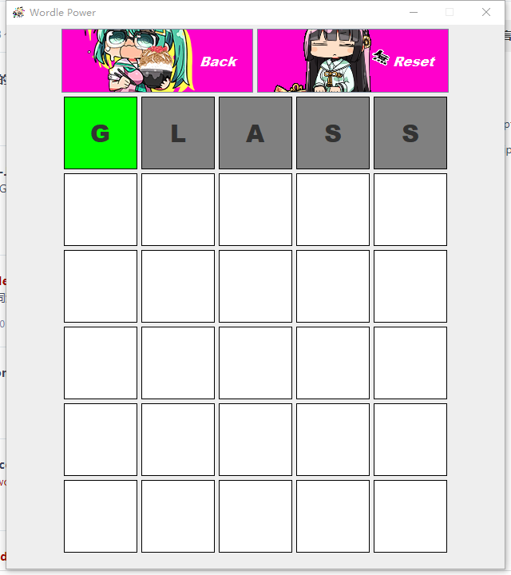
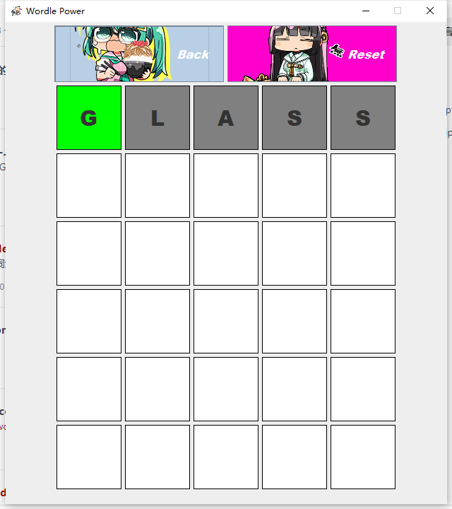
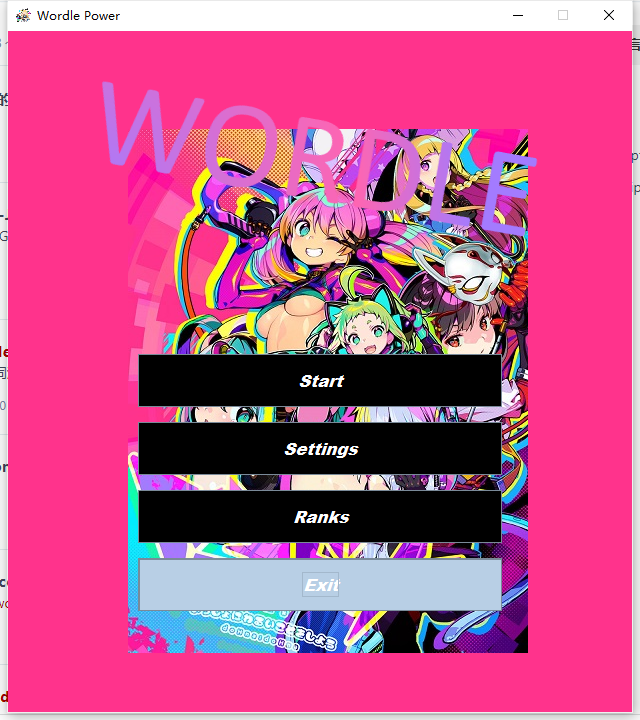
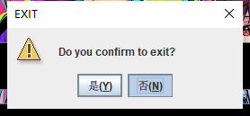
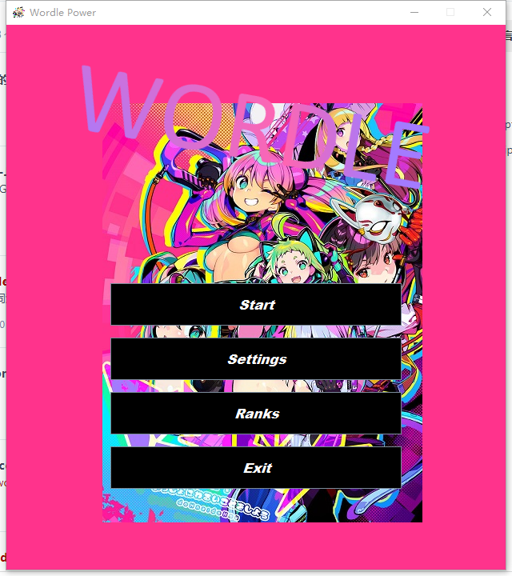
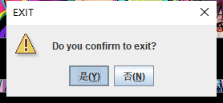

# Wordle-java

#### 介绍

一个利用java实现的具有可视化界面的单机Wordle小游戏，希望你能喜欢，也欢迎参考借鉴！
（其实就是一个小作业）

#### 软件架构

软件架构说明

#### 设计流程图

#### 安装教程

1. git clone 本仓库
2. 用Wordle.java运行

#### 使用说明

1. 如你所见，还很粗糙

#### 效果图

初始界面

第一局游戏（把单词锁死为GREEN）

空白输入

没输入完就提交

输入错误单词

输入正确

再开一局（继续锁死）

故意输错6次（失败）

再开一局（锁死）

随便输入

回退

重置（不锁死会刷新单词，这里在更新单次函数最后一行强行设置为“GREEN”）

再次做完（20s通关打败了自己的42%的尝试？）

再开一局（锁死）

随意输入

强行退出

再进入

退出

取消

确认

无了

设置和排行榜未完成